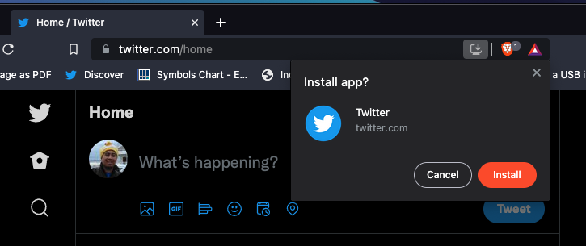
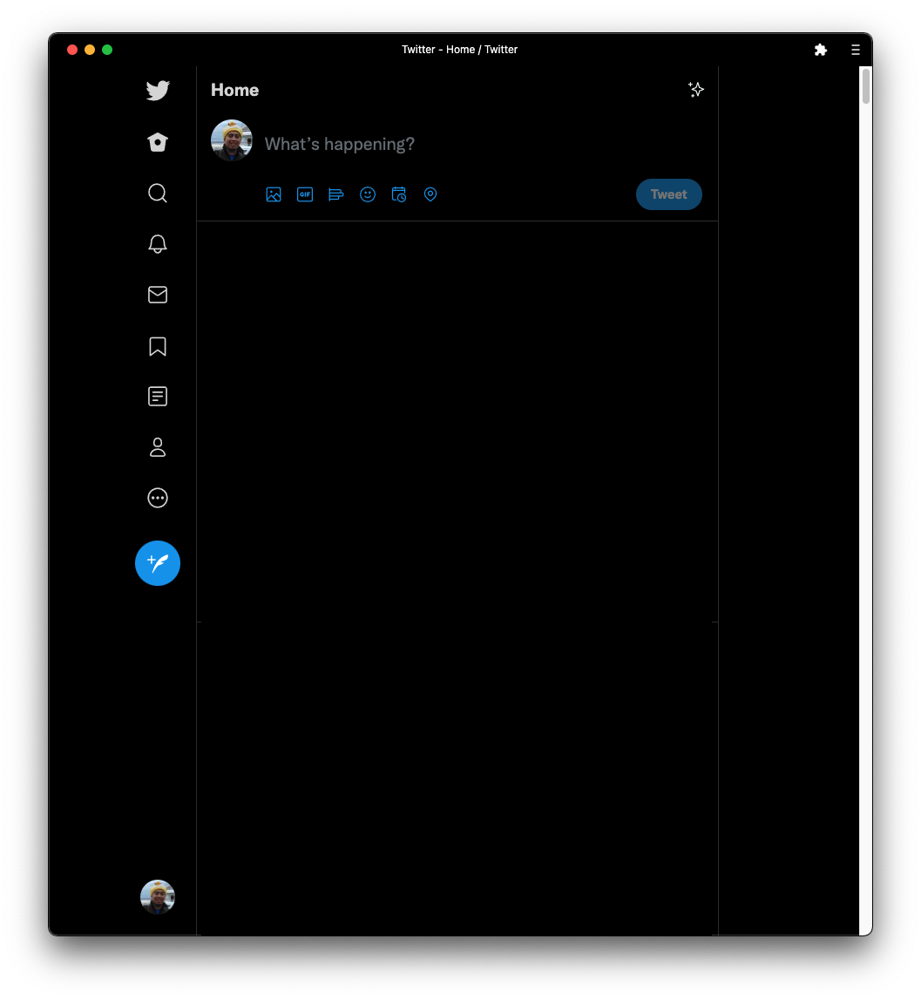

# Progressive Web Apps

Progressive Web App atau PWA adalah sebuah aplikasi hybrid yang menggabungkan kemudahaan aplikasi web dan performa aplikasi native di berbagai platform.

## Prasyarat
- Server harus menggunakan HTTPS, `localhost` bisa digunakan untuk testing
- Memiliki web app manifest `manifest.json`
- Berkas `index.html` merujuk ke berkas manifest, menggunakan `<link rel="manifest" href="manifest.json" />`
- Registrasi service worker

## App Shell

Adalah sebuah kerangka antarmuka yang merujuk ke _local resource_ yang disimpan di dalam _cache_ agar PWA dapat bekerja saat *offline*. Konsepnya adalah, App Shell adalah sebuah kumpulan kode untuk menyiapkan UI kosongan (tanpa data) yang berisi file HTML, JS, CSS, tujuannya agar ketika pengguna membuka aplikasi PWA, aplikasi tersebut bisa menampilkan langsung UI dari aplikasi tersebut tanpa harus mengunduh ulang UI dari server.

### Keuntungan Menggunakan App Shell

- Aplikasi dimuat dengan gegas dan cepat pada kondisi jaringan apapun, meskipun sedang luring (offline), aplikasi masih bisa dibuka dan akan menggunakan data / konten dari tembolok (_cache_) ketika luring, dan akan kembali mengambil data dari jaringan ketika daring (_online_).
- Konsisten dalam performa, karena berkas statis yang dibutuhkan seperti HTML, JavaScript, CSS akan disimpan dalam tembolok lokal, sehingga tidak perlu terus menerus mengunduh berkas statis ketika membuka aplikasi
- Pemrogram bisa membuat aplikasi dengan pengalaman pengguna yang sama dengan aplikasi native, seperti navigasi, interaksi, dan _offline support_
- Hemat bandwidth data

### Membuat Web App Manifest

```json
{
  "short_name": "App shell",
  "name": "App shell for progressive web app",
  "start_url": "/index.html",
  "icons": [{
        "src": "images/icon-128x128.png",
        "sizes": "128x128",
        "type": "image/png"
      }, {
        "src": "images/apple-touch-icon.png",
        "sizes": "152x152",
        "type": "image/png"
      }, {
        "src": "images/ms-touch-icon-144x144-precomposed.png",
        "sizes": "144x144",
        "type": "image/png"
      }, {
        "src": "images/chrome-touch-icon-192x192.png",
        "sizes": "192x192",
        "type": "image/png"
      },{
        "src": "images/chrome-splashscreen-icon-384x384.png",
        "sizes": "384x384",
        "type": "image/png"
      }],
  "display": "standalone",
  "orientation": "portrait",
  "background_color": "#3E4EB8",
  "theme_color": "#2E3AA1"
}
```

Rujuk berkas `manifest.json` ke berkas `index.html`

```html
<!DOCTYPE html>
<html>
    <head>
        <!-- Web Application Manifest -->
        <link rel="manifest" href="manifest.json">'
    </head>
    <body>
        ...
    </body>
</html>
```

## Service Worker

Service Worker adalah script yang dijalankan di balik layar dan terpisah dari _browser window_ untuk menangkap berbagai event, _intercept network request_, _caching_, mengirim _push messages_ atau _push notifications_.

Karena service worker berjalan sendiri dari _main thread_, ada beberapa hal yang harus diperhatikan:

- Synchronous request dan `localStorage` tidak bisa digunakan di service worker
- Service worker dapat menerima _push messages_ dari _server_ ketika aplikasi tidak sedang dibuka dan akan melanjutkan ke aplikasi sebagai _push notification_ ke pengguna meskipun aplikasi dan browser sedang tidak aktif.
- Service worker tidak dapat mengakses _DOM_ sercara langsung. Untuk berkomunikasi dengan halaman utama, service worker mengunakan `postMessage()` untuk mengirim data. Untuk menerima data, service worker menggunakan `"message"` event listener.

Yang perlu dicatat ketika membuat service worker

- Service worker adalah _programmable network proxy_ yang memungkinkan pemrogram mengatur bagaimana _network request_ dari aplikasi akan ditangani
- Service worker hanya berjalan di HTTPS, demi keamanan dan mencegah serangan "man-in-the-middle" dalam jaringan
- Service worker akan _idle_ ketika tidak digunakan dan akan _restart_ saat dibutuhkan. Informasi untuk setiap _restart cycle_ akan bisa berbeda dan tidak bisa digunakan ulang untuk setiap _restart cycle_.
- _Promises, promises everywhere_

### Fitur Service Worker

- Notifications API, untuk menampilkan dan berinteraksi dengan _push notification_ yang berjalan di atas _notificaiton system_ dari sistem operasi
- Push API, yang memungkinkan aplikasi untuk _subscribe_ dan _receive_ ke sebuah _push service_.
- Background Sync API, yang memungkinkan aplikasi untuk menunda setiap _action_ sampai koneksi dari pengguna stabil.
- Channel Messaging API, sebuah fungsi untuk komunikasi antara _web worker_ dan _service worker_

### Registrasi Service Worker

Untuk memasang service worker, pemrogram diharuskan untuk _register_ service worker tersebut di _main JavaScript_ aplikasi. Registrasi ini menginformasikan web browser di mana service worker tersebut disimpan, dan akan memasang di _background_.

`main.js`

```js
if ('serviceWorker' in navigator) {
    navigator.serviceWorker.register('/service-worker.js')
        .then(function (registration) {
            // registration success
        })
        .catch(function (error) {
            console.log('Service worker registration failed', error)
        })
}
```

**Server Config**

Set `Service-Worker-Allowed` di response header dari Server

**Service Worker Lifecycle**
> `install` -> `activate`

`service-worker.js`

```js
self.addEventListener('install', function(event) {
    // perform some task like precache the app
})

self.addEventListener('activate', function(event) {
    // perform some task like clean up outdated caches
})
```

## Multiplatform dan Native Experience

Sebuah PWA haruslah responsive pada setiap ukuran layar, layar desktop dengan ukuran sedang hingga besar, layar _mobile phone_ dengan ukuran kecil, hingga layar tablet dengan ukuran sedang. Dengan layout UI yang responsive, PWA bisa menjadi opsi untuk menggantikan native application di berbagai macam perangkat.

Selain itu, pengalaman pengguna (UX) dari PWA juga harus bisa beradaptasi dengan aplikasi native, seperti navigasi, notifikasi, performa, kecepatan saat membuka aplikasi, dan harus bisa dipasang sebagai aplikasi native (installable).

Contoh Aplikasi PWA:
- [Twitter](https://twitter.com) (Twitter Desktop dan Twitter Lite di mobile browser)
- [Telegram Web](https://web.telegram.org)
- [Instasgram Web](https://instagram.com)
- [Spotify Web](https://open.spotify.com)



_Pilihan untuk memasang PWA sebagai aplikasi native_



_Aplikasi yang dipasang dari PWA memiliki UX sebagai native app, perhatikan app bar / window bar yang tidak memiliki fungsi navigasi seperti di web browser_

## SAATNYA TUGAS
- Mencoba Progressive Web App
  - Buka salah satu contoh PWA di atas
  - Pilih install ketika dialog install muncul di browser, terutama di mobile browser smartphone
  - Buka aplikasi PWA yang sudah terpasang
  - Tutup aplikasi
  - Buka kembali dan rasakan perbedaannya antara PWA dengan web app
- Konversikan aplikasi web atau react app yang sudah ada menjadi PWA
  - Tambahkan file web manifest
  - Buatlah file service worker
  - Registrasikan service worker ke project
  - Buka Browser Developer Tools -> Application -> Service Workers, dan periksa apakah service worker berjalan di browser