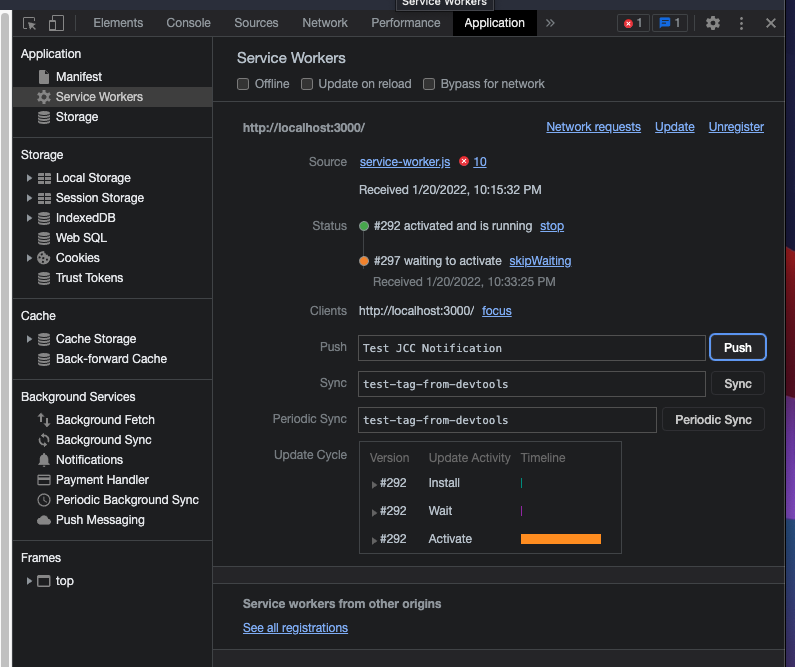
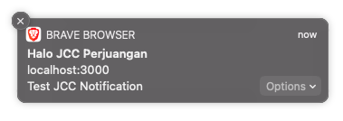

# Push dan Message

Push API dan Notifications API adalah API berbeda tetapi bisa digunakan untuk memberikan fungsionalitas yang bisa menarik pengguna.

Push API digunakan untuk mengerimkan konten baru dari server ke aplikasi tanpa adanya campur tangan dari aplikasi _client side_, dan berjalan di service worker. Data dari Push digunakan untuk menambahkan konten ke cache atau digunakan untuk menampilkan notifikasi ke Notification API.

Keduanya berjalan di service worker, sehingga update konten dari server dan notifikasi bisa ditampilkan ketika aplikasi tidak sedang dibuka.

## Push API

`service-worker.js`

```js
self.addEventListener('push', (event) => {
    console.log("PUSH", event.data)
    // Add to cache for push data
})
```

## Notifications API

Pada dasarnya, menampilkan Notifikasi bisa saja langsung dari aplikasi, akan tetapi aplikasi harus selalu terbuka untuk menampilkan notifikasi, oleh karena itu notifikasi disimpan di service worker, agar ketika aplikasi tersebut ditutup, notifikasi akan tetap muncul ketika menerima update dari server.

Menguji fitur browser sebelum implementasi, bisa disisipkan di `main.js`, bagian kode ini tidak akan digunakan ketika _push notification_ diterima oleh _service worker_.

```js
Notification.requestPermission().then(function(result) {
    if (result === 'granted') {
        // Send notification
        randomNotification()
    }
})

function randomNotification() {
    new Notification('Just Notification', {
        body: 'This is test notification',
        icon: 'icon.jpg'
    })
}

```

### Push Notifications

Push lebih kompleks, aplikasi diharuskan _subscribe_ ke sebuah server yang akan mengirim data ke aplikasi, selanjutnya service worker di aplikasi akan menerima data dari push server, kemudian menampilkannya dengan _notification system_.

Di dalam berkas `main.js` ketika register service worker, tambahkan bagian `registration.pushManager.getSubscription()` agar aplikasi _subscribe_ ke push service.

`main.js`

```js
if ('serviceWorker' in navigator) {
    navigator.serviceWorker.register('/service-worker.js')
        .then(function (registration) {
            // registration success

            return registration.pushManager.getSubscription()
                .then(async function(subscription) {
                    // if subscription found, return it
                    if (subscription) {
                        return subscription
                    }

                    // otherwise, subscribe a new one

                    return registration.pushManager.subscribe({
                        userVisibleOnly: true,
                        applicationServerKey: 'VAPID_KEY'
                    })
                })
        })
        .then(function (subscription) {
            // Send the subscription detail to your push server
            // Implementation in GCM may different, use the SDK instead
            fetch(YOUR_SERVER_PUSH_MESSAGE_HOST + REGISTER_ENDPOINT, {
                method: 'POST',
                headers: {
                    'Content-Type': 'application/json'
                },
                body: JSON.stringify({
                    subscription: subscription
                })
            })
        })
        .catch(function (error) {
            console.log('Service worker registration failed', error)
        })
}
```

`service-worker.js`

```js
self.addEventListener('push', (event) => {
    const notificationBody = event.data?.text() || "No Message"
    console.log("PUSH", notificationBody)
    var options = {
        body: notificationBody,
        icon: './logo192.png',
        actions: [
            {
                action: 'explore', title: 'Explore'
            },
            {
                action: 'close', title: 'Close'
            }
        ]
    }
    event.waitUntil(
        self.registration.showNotification('NOTIFICATION_TITLE', options)
    )
})

```

Untuk mengaktifkan Push Notification, diperlukan VAPID KEY yang bisa didapat dari Google Cloud Messaging, atau tergantung dari implementasi `push server` masing-masing aplikasi.

Untuk menguji push notification, buka Developer Tools -> Applications -> Service Workers, di kolom Push, masukan body push message lalu klik Push.



Jika setup berjalan dengan baik, service worker akan mengirimkan notifikasi dan memunculkan di layar.




## Message

Cara untuk berkomunikasi antara `service worker` dan `client` adalah dengan mengirimkan event `message` dengan data yang dibutuhkan.

`service-worker.js`

```js
self.addEventListener('message', event => {
    console.log('MESSAGE', event.data)
})
```

### Service Worker -> Client

`service-worker.js`

```js
self.clients.matchAll().then(clients => {
    clients.forEach(client => client.postMessage('Greeting from Service Worker'))
})
```

`main.js`

```js
navigator.serviceWorker.onmessage = (event) => {
    console.log('Message from Service Worker', event.data)
}
```

### Client -> Service Worker

`service-worker.js`

```js
self.addEventListener('message', event => {
    console.log('MESSAGE', event.data)
})
```

`main.js`

```js
navigator.serviceWorker.controller.postMessage('Hello service worker!')
```

Payload untuk message bisa berupa `string`, `number`, atau `object`, misal object `{type: 'MESSAGE_TYPE', payload: 'MESSAGE_PAYLOAD'}`.

