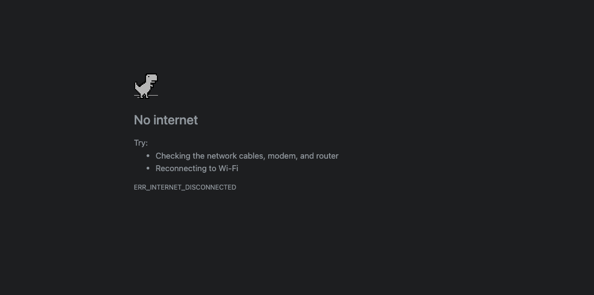

# Offline First

Kembali ke tujuan PWA agar aplikasi bisa digunakan dalam kondisi jaringan apapun, baik cepat, lambat atau bahkan tanpa jaringan, PWA harus memiliki konsep _Offline First_ atau _offline support_.

Tambahkan kode berikut ke berkas `service worker`

Pertama-tama, tentuka nama cache untuk aplikasi, juga berkas apa saja yang akan disimpan di cache.

```js
const cacheName = 'yourApp-cache-Name-v1.0.0'
const cachedFiles = [
    // list of static files
]
```

Selanjutnya saat fase `install`, masukan semua berkas ke dalam cache

```js
self.addEventListener('install', function(event) {
    console.log('[Service Worker] Installing')
    event.waitUntil((async () => {
        const cache = await caches.open(cacheName)
        await cache.addAll(cachedFiles)
    })())
})
```

Untuk membersihkan cache lama dari dalam storage, gunakan fase `activate` untuk membersihkan cache yang sudah usang dan tidak dibutuhkan lagi

```js
self.addEventListener('activate', function(event) {
    console.log('[Service Worker] Activating')
    // perform some task like clean up outdated caches
    event.waitUntil(caches.keys().then((keys) => {
        return Promise.all(keys.map((key) => {
            if (key === cacheName) {
                return
            }
            return caches.delete(key)
        }))
    }))
})
```

Selanjutnya adalah cache setiap HTTP response yang dieksekusi oleh aplikasi, hal ini sangat berguna untuk _intercept_ seluruh _request_ dan diteruskan dengan respon yang telah dimodifikasi.

Responnya bisa apa saja, bisa berupa berkas, _cached copy_, atau fungsi JavaScript.

Contoh dalam kode ini, service worker akan menyajikan berkas dari _cache_, bukan dari jaringan selama berkas tersebut ada di dalam cache. Jika berkas yang diminta tidak ada di dalam cache, service worker akan menyimpannya ke dalam _cache_ saat respon diterima sebelum respon tersebut dikembalikan ke aplikasi.

```js
self.addEventListener('fetch', function(event) {
    console.log('[Service Worker] Fetch request for: ', event.request.url)
    // Return from cache if failed
    event.respondWith((async () => {
        const cacheResponse = await caches.match(event.request)
        if (cacheResponse) {
            return cacheResponse
        }
        const response = await fetch(event.request)
        const cache = await caches.open(cacheName)
        console.log('[Service Worker] Caching resource: ', event.request.url)
        cache.put(event.request, response.clone())
        return response
    })())
})
```

## Memperbaharui Berkas

Untuk memperbaharui isi dari service worker ketika ada update di aplikasi, update version number yang ada di `cacheName` sehingga semua cache baru akan ditambahkan saat `install` dan cache lama akan dihapus saat `activate`. Contoh, dari `'yourApp-cache-Name-v1.0.0'` ke `'yourApp-cache-Name-v1.0.2'`.

```js
const cacheName = 'yourApp-cache-Name-v1.0.1'
const cachedFiles = [
    // list of static files
]

cachedFiles.push('/public/assets/fallback.css')
```

## Menampilkan Halaman Lain ketika _Offline_

Kebanyakan pengguna sangat kesal ketika mereka melihat "gambar dinosaurus" ketika tidak tersambung ke internet ketika sedang membuka aplikasi, kenapa?
- User tidak bisa melakukan apa-apa
- Gambar dinosaurus tidak terlalu user friendly dengan berbagai error status yang muncul
- Menandakan bahwa aplikasi yang dibuat tidak siap menangani permasalahan jaringan



Bagaimana mengatasinya? Salah satu pilihannya adalah
- Berikan konten dari cache, sehingga "feed" atau konten dari aplikasi tetap tampil (seperti contoh kode di atas)
- Berikan default landing page, bisa berupa halaman statis yang informasinya mudah dipahami, atau bahkan berikan game berbasis web yang lebih menyenangkan dari dinosaurus loncat-loncat

Langkah pertama, buatlah halaman fallback dengan nama apapun, misal `offline.html`

```html
<!DOCTYPE html>
<html lang="en">
    <head>
        <meta charset="utf-8" />
        <meta http-equiv="X-UA-Compatible" content="IE=edge" />
        <meta name="viewport" content="width=device-width, initial-scale=1" />
        <title>You are Offline</title>
    </head>
    <body>
        <h1>You are Offline</h1>
        <p>Seems you have trouble connecting to the internet, click Reload button to reloading</p>

        <button id="reload" type="button">Reload</button>

        <script>
            document.getElementById('reload').addEventListener('click', () => {
                window.location.reload()
            })

            // Listen to network state, reload when online
            window.addEventListener('online', () => {
                window.location.reload()
            })

            // Check if server is responding and reload
            // Handles when online but the server is offline
            async function checkServerConnection() {
                try {
                    const response = await fetch('.')

                    if (response.status >= 200 && response.status < 500) {
                        window.location.reload()
                        return
                    }
                } catch {
                    // Unable to connect
                }
                // Check every 3 seconds
                window.setTimeout(checkServerConnection, 3000)
            }

            checkServerConnection()
        </script>
    </body>
<html>
```

Update berkas service worker untuk menambahkan file `offline.html` ke cache dan menampilkannya ketika tidak terhubung ke jaringan.

```js
const offlineFallbackUrl = 'offline.html'

const cacheName = 'yourApp-cache-Name-v1.0.1'
const cachedFiles = [
    // list of static files
    offlineFallbackUrl
]

self.addEventListener('install', function(event) {
    console.log('[Service Worker] Installing')
    event.waitUntil((async () => {
        const cache = await caches.open(cacheName)
        await cache.addAll(cachedFiles)
    })())
})

self.addEventListener('fetch', function(event) {
    // Only return the offline page when navigating to other page
    if (event.request.mode === 'navigate') {
        event.respondWith(
            (async() {
                try {
                    // try to use the navigation preload response if it's supported.
                    const preloadResponse = await event.preloadResponse
                    if (preloadResponse) {
                        return preloadResponse
                    }

                    // always try network first
                    const networkResponse = await fetch(event.request)
                    return networkResponse
                } catch (error) {
                    // execute if network error
                    console.log('Fetch failed, return offline fallback page', error)

                    const cache = await caches.open(cacheName)
                    const cachedResponse = await cache.match(offlineFallbackUrl)
                    return cachedResponse
                }
            })()
        )
    }
    console.log('[Service Worker] Fetch request for: ', event.request.url)
    // Return from cache if failed
    event.respondWith(
        (async () => {
            const cacheResponse = await caches.match(event.request)
            if (cacheResponse) {
                return cacheResponse
            }
            const response = await fetch(event.request)
            const cache = await caches.open(cacheName)
            console.log('[Service Worker] Caching resource: ', event.request.url)
            cache.put(event.request, response.clone())
            return response
        })()
    )
})
```