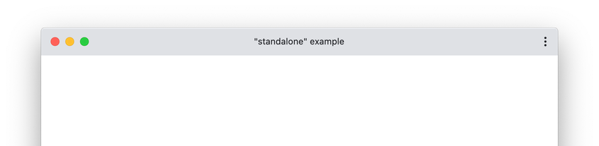
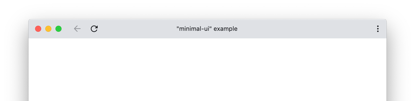
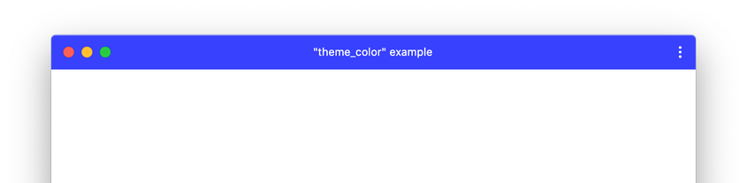
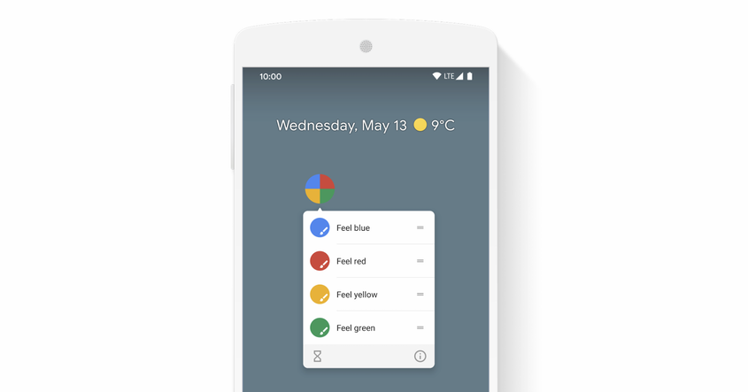
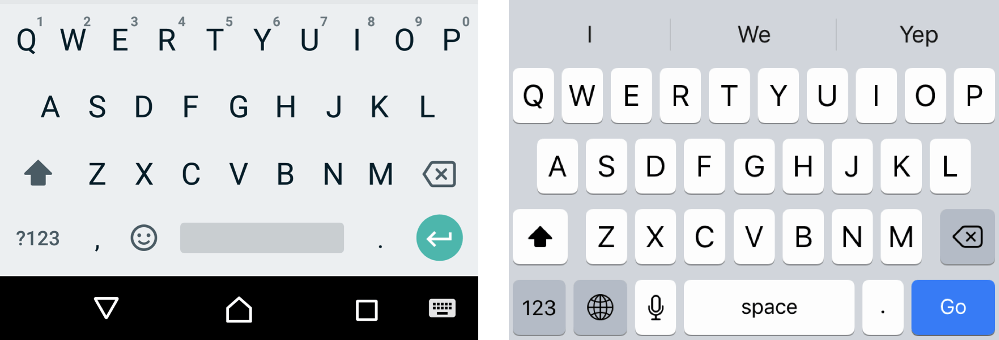

# Mobile Experience

Goal dari PWA adalah membuat aplikasi web memiliki pengalaman pengguna yang sama dengan native app, salah satunya _mobile native app_.

## Display

Untuk memberikan pengalaman pengguna rasa native app, semua dimulai dari layar, untuk mode layar yang didukung di PWA ada empat macam

| Property | Description |
|----------|-------------|
| `fullscreen` | Membuka web app tanpa _browser UI_ dan mengisi seluruh area layar |
| `standalone` | Membuka web app agar serasa seperti aplikasi _standalone_, berjalan di dalam _window_nya sendiri, serta tidak menampilkan UI _browser_ seperti URL bar, tombol navigasi, tombol refresh <br/>  |
| `minimal-ui` | Mirip dengan `standalone` dengan tambahan minimal browser UI untuk navigasi seperti tombol navigasi dan tombol reload <br/>  |
| `browser`    | Standar browser UI |

`manifest.json`

```json
{
    ...
    "display": "standalone",
    ...
}
```

## Theme Color

`theme_color` dalam manifest akan menampilkan warna di toolbar aplikasi, dan isinya harus sesuai dengan `theme_color` yang disisipkan sebagai `meta` di dalam `head` berkas `index.html`



`manifest.json`

```json
{
    ...
    "theme_color": "#4285f4",
    ...
}
```

`index.html`

```html
<html>
    <head>
        <meta name="theme-color" content="#4285f4">
    </head>
    ...
</html>
```


## Shortcut

Shortcut atau App Shortcuts adalah sebuah object untuk menampilkan pintasan untuk membuka tugas / halaman tertentu dari aplikasi.



`manifest.json`

```json
{
    ...
    "shortcuts": [
        {
            "name": "Buka Halaman Blog",
            "short_name": "Blog",
            "url": "/blog",
            "icons": [
                {
                    "src": "/icons/blog.png",
                    "sizes": "192x192"
                }
            ]
        },
        {
            "name": "Buka Halaman Biaya",
            "short_name": "Pricing",
            "url": "/pricing",
            "icons": [
                {
                    "src": "/icons/pricing.png",
                    "sizes": "192x192"
                }
            ]
        }
    ]
    ...
}
```

## Layout

Sudah seharusnya PWA memiliki layout responsive mengikuti dari ukuran layar. Untuk hal ini, bisa menggunakan _CSS media query_, atau menggunakan CSS library untuk mempermudah.

## Navigation

Yang perlu diperhatikan di mobile device adalah bagaimana cara menggunakan navigasi di aplikasi, dikarenakan di perangkat bergerak ada tombol navigasi secara fisik, seperti tombol kembali, navigasi antar tampilan menjadi sangat penting untuk diperhatikan.

Optimisasi navigasi ini bisa dioptimalkan di sisi aplikasi dan tidak perlu setup apapun di `service-worker`.

Pada library Single Page Application, pemrogram akan terbiasa dengan API `push()` atau `pushState()`, `replace()` atau `replaceState()`, `back()`, `forward()` dan `go()`.

| API | Penjelasan | Penggunaan |
|-----|------------|------------|
| `push()` atau `pushState(state, title [, url])` | Menambahkan history baru ke array history | Gunakan untuk menuju ke halaman baru |
| `replace()` atau `replaceState(state, title [, url])` | Menimpah history yang sedang aktif saat ini | Gunakan untuk membuka fragment jika fragment adalah sebuah sub path, atau jika halaman saat ini tidak ingin ditampilkan ketika pengguna mengakses tombol kembali |
| `back()` | Untuk kembali ke history sebelumnya | Membuka kembali ke history sebelumnya sejauh 1 langkah |
| `forward()` | Untuk kembali ke history selanjutnya | Membuka kembali ke history selanjutnya sejauh 1 langkah |
| `go(index: number)` | Untuk menuju ke history dengan target yang lebih spesifik dari posisi halaman saat ini | Misal `go(-1)` akan kembali satu halaman (`back()`) atau `go(1)` akan menuju ke satu halaman (`forward()`) |

### How it Works

#### Push

```
History saat ini
[0: {}, 1: {}, 2: {}]
               ^
            active

`push('/a')`

[0: {}, 1: {}, 2: {}, 3: {pathname: '/a'}]
                      ^
                    active

User akses tombol kembali (atau dengan `back()`)
[0: {}, 1: {}, 2: {}, 3: {pathname: '/a'}]
               ^
            active
```

### Replace

```
History saat ini
[0: {}, 1: {}, 2: {}]
               ^
            active

`replace('/a')`

[0: {}, 1: {}, 2: {pathname: '/a'}]
                      ^
                    active

User akses tombol kembali (atau dengan `back()`)
[0: {}, 1: {}, 2: {pathname: '/a'}]
        ^
     active
```

### Back

```
History saat ini
[0: {}, 1: {}, 2: {}]
               ^
            active

`back()`
[0: {}, 1: {}, 2: {}]
        ^
      active
```

### Forward

```
History saat ini
[0: {}, 1: {}, 2: {}]
        ^
      active

`forward()`
[0: {}, 1: {}, 2: {}]
               ^
            active
```

### Go

```
History saat ini
[0: {}, 1: {}, 2: {}, 3: {}]
                      ^
                    active

`go(-3)`
[0: {}, 1: {}, 2: {}, 3: {}]
 ^
active

`go(2)`
[0: {}, 1: {}, 2: {}, 3: {}]
               ^
            active
```

## Keyboard

Pada mobile app atau mobile device, virtual keyboard yang muncul bergantung dari tipe apa yang didefinisikan dari sebuah _input form_.

Untuk menentukan tipe keyboard, bisa memanfaatkan properti `inputmode`.

### `numeric`

```html
<input type="text" inputmode="numeric" />
```

Untuk input berupa angka tanpa huruf alfabet |


_Kiri: Android, Kanan: iOS_

### `tel`

Untuk input berupa nomor telepon, layout keyboard yang muncul adalah T9

```html
<input type="text" inputmode="tel" />
```


_Kiri: Android, Kanan: iOS_

### `decimal`

```html
<input type="text" inputmode="decimal" />
```

Mirip dengan `numeric`, perbedaan yang paling terasa adalah di keyboard iOS yang memiliki layout T9 dan menggantikan `+*#` menjadi simbol desimal tergantung dari `locale` dari device tersebut, bisa `,` atau `.`.


_Kiri: Android, Kanan: iOS_

### `email`

```html
<input type="text" inputmode="email" />
```

Input mode `email` akan menampilkan keyboard seperti biasanya, dengan tambahan simbol `@` di layer keyboard pertama dan `.` juga, pada beberapa keyboard akan ditemukan shortcut TLD seperti `.com`.


_Kiri: Android, Kanan: iOS_

### `url`

```html
<input type="text" inputmode="url" />
```

Pada mode `url`, keyboard akan menampilkan `/`, `.` dan juga TLD, TLD yang ditampilkan bergantung pada support dari locale dan keyboard, umumnya menggunakan `.com`.


_Kiri: Android, Kanan: iOS_

### `search`

```html
<input type="text" inputmode="search" />
```

Untuk mode `search`, tombol _return_ di pojok kanan bawah akan berganti menjadi tombol aksi _submit_, jika di method lain fungsinya mirip dengan tombol `Tab` di keyboard desktop, maka di `search` berfungsi seolah menekan tombol `Enter` ketika ditekan.



_Kiri: Android, Kanan: iOS_

## Reference

- [https://developer.mozilla.org/en-US/docs/Web/Progressive_web_apps/Responsive/Mobile_first](https://developer.mozilla.org/en-US/docs/Web/Progressive_web_apps/Responsive/Mobile_first)
- [https://web.dev/add-manifest/](https://web.dev/add-manifest/)
- [https://web.dev/app-shortcuts/](https://web.dev/app-shortcuts/)
- [https://css-tricks.com/everything-you-ever-wanted-to-know-about-inputmode/](https://css-tricks.com/everything-you-ever-wanted-to-know-about-inputmode/)